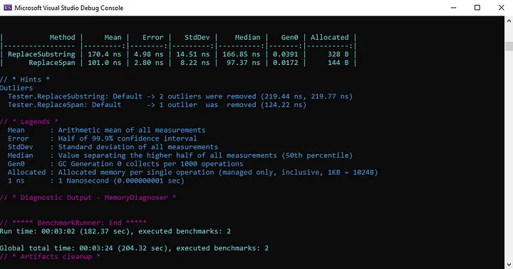

If you’re working with strings in C#, you’ve probably encountered the need to extract substrings or manipulate portions of a string. Traditionally, you would use the Substring method to extract a portion of a string, but there's a newer alternative called "spans" that you might want to consider.

In this article, we’ll take a look at the differences between substrings and spans in C#, and discuss how you can use each approach efficiently to handle strings in your code.

## What are Substrings?

A substring is a portion of a string that you extract using the Substring method in C#.

Here’s an example of how you would extract a substring from a string in C#:

```csharp
string originalString = "The quick brown fox jumps over the lazy dog";
string substring = originalString.Substring(4, 5); // == quick
```

In this example, we’re extracting a substring starting at index 4 and with a length of 5 characters. The resulting substring variable will contain the text "quick".

## What are Spans?
Spans are a newer alternative to substrings in C#. They provide a more efficient way to manipulate strings.

A span is essentially a “view” of a portion of a larger array or string, without actually creating a new instance of that portion. This means that you can manipulate the data in the span without affecting the original data.

Here’s an example of how you would create a span in C#:
```csharp
string originalString = "The quick brown fox jumps over the lazy dog";
ReadOnlySpan<char> span = originalString.AsSpan(4, 5); // == quick
```

In this example, we’re creating a read-only span that starts at index 4 and has a length of 5 characters. The resulting span variable will contain the same text (quick) as the substring variable from the previous example.

## Benefit of Using Spans
Because spans are essentially “views” of a portion of a larger array or string, they don’t create new instances of that data. This means that using spans can be much more efficient than using substrings, especially when dealing with large strings.

## When to Use Substrings vs. Spans
While spans are generally more efficient than substrings, there are still some cases where substrings might be more appropriate. For example, if you’re working with a small string or only need to extract a single substring, the performance benefits of using spans might not be significant enough to justify the additional complexity.

## Real world example comparison
I’ve created an example benchmark console application, which you can run for your own knowledge. Below you can see an example result of the benchmark.



You can see is that the ReplaceSpan method is roughly 40% faster. Moreover, the allocated memory is more than 50 percent less.