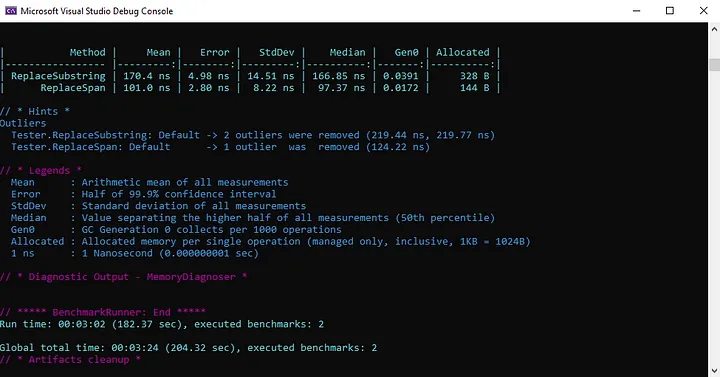

Als je met strings werkt in C#, ben je waarschijnlijk de behoefte tegengekomen om substrings te extraheren of delen van een string te manipuleren. Traditioneel zou je de Substring-methode gebruiken om een deel van een string te extraheren, maar er is een nieuwere alternatief genaamd "spans" die je misschien wilt overwegen.

In dit artikel bekijken we de verschillen tussen substrings en spans in C#, en bespreken we hoe je elke aanpak efficiënt kunt gebruiken om strings in je code te verwerken.

## What are Substrings?

Een substring is een deel van een string dat je extraheert met de Substring-methode in C#.

Hier is een voorbeeld van hoe je een substring uit een string in C# zou extraheren:

```csharp
string originalString = "The quick brown fox jumps over the lazy dog";
string substring = originalString.Substring(4, 5); // == quick
```

In dit voorbeeld extraheren we een substring die begint bij index 4 en een lengte heeft van 5 tekens. De resulterende substring-variabele zal de tekst "quick" bevatten.

## Wat zijn Spans?
Spans zijn een nieuwere alternatief voor substrings in C#. Ze bieden een efficiëntere manier om strings te manipuleren.

Een span is in wezen een “weergave” van een deel van een grotere array of string, zonder daadwerkelijk een nieuwe instantie van dat deel te maken. Dit betekent dat je de gegevens in de span kunt manipuleren zonder de originele gegevens te beïnvloeden.

Hier is een voorbeeld van hoe je een span in C# zou aanmaken:
```csharp
string originalString = "The quick brown fox jumps over the lazy dog";
ReadOnlySpan<char> span = originalString.AsSpan(4, 5); // == quick
```

In dit voorbeeld maken we een alleen-lezen span die begint bij index 4 en een lengte heeft van 5 tekens. De resulterende span-variabele zal dezelfde tekst (quick) bevatten als de substring-variabele uit het vorige voorbeeld.

## Voordeel van het Gebruiken van Spans
Omdat spans in wezen “weergaven” zijn van een deel van een grotere array of string, maken ze geen nieuwe instanties van die gegevens aan. Dit betekent dat het gebruik van spans veel efficiënter kan zijn dan het gebruik van substrings, vooral bij het omgaan met grote strings.

## Wanneer Substrings vs. Spans te Gebruiken
Hoewel spans over het algemeen efficiënter zijn dan substrings, zijn er nog steeds gevallen waarin substrings misschien geschikter zijn. Bijvoorbeeld, als je met een kleine string werkt of slechts één substring hoeft te extraheren, zijn de prestatievoordelen van het gebruik van spans mogelijk niet significant genoeg om de extra complexiteit te rechtvaardigen.

## Vergelijking met een Voorbeeld uit de Praktijk
Ik heb een voorbeeld benchmark console toepassing gemaakt, die je kunt uitvoeren voor je eigen kennis. Hieronder zie je een voorbeeldresultaat van de benchmark.



Wat je kunt zien is dat de ReplaceSpan-methode ongeveer 40% sneller is. Bovendien is het toegewezen geheugen meer dan 50 procent minder.